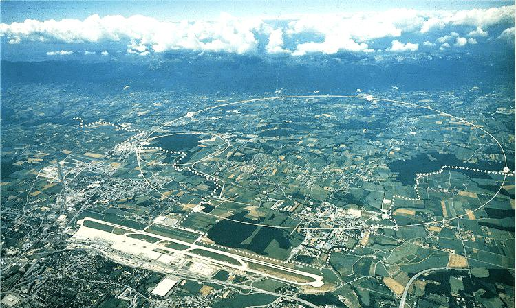
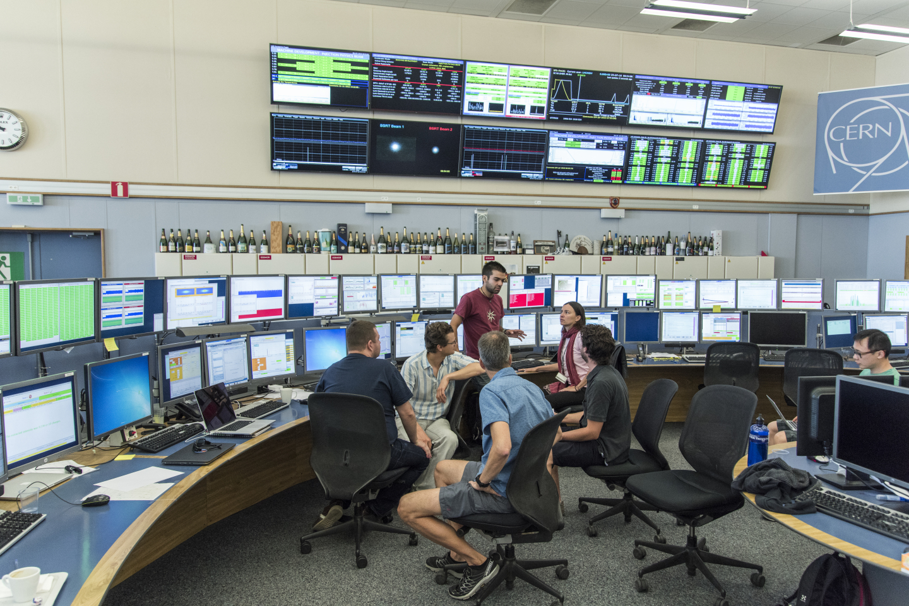
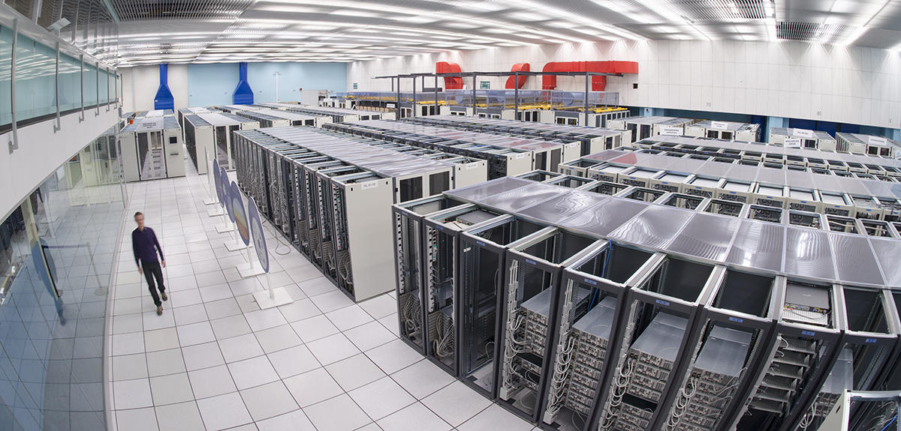

<!-- .slide: data-background="images/background.svg" data-background-size="cover" -->

---

## Le CERN

- Des milliers de scientifiques y travaillent...
- pour comprendre comment fonctionne l'univers

Note: Le CERN est à la frontière entre la France et la Suisse.

---

## Le LHC, une très grande machine

- C'est un tunnel rond, long de 27 kilomètres
- Il est sous terre, à environ 100 mètres de profondeur
- À l'intérieur, de minuscules particules tournent très vite, presque à la vitesse de la lumière
- Quand elles se percutent, elles se brisent en morceaux

--

## Le tunnel souterrain

--

## La salle de contrôle

---

## Revenir au début de l'univers

- Juste après le Big Bang, l'univers était très chaud
- Il était rempli d'une grande soupe de particules qui bougeaient dans tous les sens
- Au CERN, on recrée ce tout début de l'univers, pendant un instant très court

Note: Le début de l'univers dure un instant minuscule. Ne pas donner de chiffres précis aux enfants.

--

## La soupe cosmique

- Au tout début, rien ne tenait encore la matière ensemble
- Tout était si chaud que les particules bougeaient librement, comme une soupe
- En refroidissant, l'univers a permis aux particules de se coller : protons, neutrons, puis atomes

---

## Pourquoi c'est important ?

- Pour comprendre pourquoi la matière existe, et pourquoi tout ce qui nous entoure est là
- En 2012, les scientifiques du CERN ont trouvé une particule appelée le boson de Higgs
- Le boson de Higgs aide les particules à avoir du poids

--

## Le centre de calcul

Note: Les données des expériences sont stockées et analysées ici.

---

## Tout est fait de matière

- Tout autour de nous est fait de matière : le bois, l'eau, l'air, les nuages
- Même la sauce ketchup !

---

## Plus on zoome, plus on voit petit

- On part d'un morceau de bois, puis on zoome
- On arrive jusqu'aux quarks, les ingrédients les plus simples connus à ce jour

---

## On peut deviner sans voir

- Les traces dans la neige montrent qu'un animal est passé
- On ne l'a pas vu, mais on sait qu'il est là

---

## Détecter sans voir

- Un détecteur de fumée réagit aux petites particules de fumée
- On ne les voit pas, mais le détecteur sonne quand elles arrivent

---

## Tout est fait de particules

- Tout ce qui nous entoure est fait de particules
- Elles sont si petites que personne ne peut les voir, même avec le meilleur microscope
- Il n'y en a que 12 sortes principales
- Pour l'instant, on ne sait pas les couper en morceaux plus petits

Note: Ne pas dire « les plus petites » : les protons, par exemple, sont faits de particules plus petites encore.

--

## Les ingrédients de tous les jours

- Les quarks « haut » et « bas » forment les protons et les neutrons
- Les protons et les neutrons se trouvent au cœur des atomes
- L'électron tourne autour du cœur de l'atome
- Les autres particules se transforment vite en particules plus simples

--

## Les quarks

- Il y en a 6 sortes : haut, bas, étrange, charmé, beau et top
- Ils ne vivent jamais seuls : ils sont toujours collés à d'autres quarks

Note: Les quarks portent une « charge de couleur » qui n'a rien à voir avec les couleurs que l'on voit.

--

## Les leptons

- Il y en a 6 sortes : l'électron, le muon, le tau, et 3 neutrinos
- Les neutrinos sont presque invisibles : ils traversent tout, même la Terre, sans rien toucher

---

## Les forces : les techniques de cuisine

- La force forte : une colle qui tient les quarks ensemble (le gluon)
- La force électromagnétique : elle relie les électrons aux atomes (le photon)
- La force faible : elle transforme une particule en une autre (les bosons W et Z)

--

## Hors du tableau

- Le boson de Higgs n'est pas une force : il aide les particules à avoir du poids
- La gravité, qui nous fait tomber, n'est pas dans ces règles

---

## Un quark ne vit jamais seul

- Les quarks se rangent toujours par groupes : par trois, comme le proton, ou par deux
- Un quark tout seul n'a jamais été vu

Note: Le proton est formé de deux quarks « haut » et d'un quark « bas ». Sa charge électrique vaut +1.

---

## Et dans Cosmic Chef ?

- Les quarks et les leptons sont les ingrédients
- Les bosons sont les techniques de cuisine
- Les groupes de quarks, comme le proton, sont les plats
- Il faut toujours garder l'équilibre des charges électriques (+ et −)

---

## Cosmic Chef

Note: La suite de l'histoire est racontée par l'orateur.
